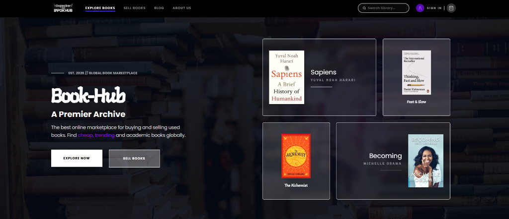

# 📖 Book-Hub: The Future of Archive & Exchange

<div align="center">


**A Premium C2C Solution for Bangladesh's Literary Community.**
<br />
[Live Demo](https://oxpecker.pro.bd) • [Report Issue](https://github.com/CoderGUY47/c2c-book-hub/issues) • [Migration Details](frontend/MIGRATION_REPORT.md)

</div>

<br/>

<table>
  <tr>
    <td align="center">
      
    </td>
  </tr>
  <tr>
    <td align="center"><sub>📖 Book-Hub: Explore and Exchange Books Grid Preview</sub></td>
  </tr>
</table>

---

## 🎯 The Vision & Objective
The core objective of **Book-Hub** is to democratize access to knowledge in Bangladesh. By bridging the gap between book owners and seekers, we've created a premium marketplace where one person’s "finished read" becomes another person’s "hidden treasure." 

Our goal is simple: **Reduce waste, lower reading costs, and build a circular economy for literature.**

---

## 💡 The "Eureka" Moment (The Origin Story)
As a passionate reader living in Bangladesh, I noticed a frustrating pattern: academic and trending books are either prohibitively expensive or hard to find once they leave physical bookstores. One evening, staring at my own overflowing bookshelf of books I'd likely never read again, the idea clicked—**"What if every shelf in Bangladesh was a part of one giant library?"**

Book-Hub was born out of a desire to turn static bookshelves into dynamic hubs of exchange. I wanted a platform that felt as premium as an international bookstore but served the local community with authentic used-book listings.

---

## 🚀 Why we migrated from MetroVPS to Vercel?
Originally, we hosted on **MetroVPS** using a traditional manual deployment flow. However, we faced critical bottlenecks:
*   **Speed:** Latency in Bangladesh was higher due to static server routing.
*   **Authentication Drops:** Session cookies were unstable due to reverse proxy configurations.
*   **Scaling:** Every update required manual Git pulls and PM2 restarts.

**The Move to Vercel:** We converted to Vercel to leverage their **Edge Network** and **Serverless Functions**. This migration fixed our authentication bugs instantly and provided ultra-fast global delivery via their CDN. It turned a "hobby project" into a "production-grade enterprise application."

---

## 🛠️ The Solving Process (Engineering Challenges)
Moving to Vercel wasn't just a "point and click." We had to re-engineer core systems:
*   **The API Bridge:** We moved from the Next.js App Router to the **Pages Router** for the backend bridge to unlock native Node.js request/response streams for 100% cookie reliability.
*   **Strict Typing:** We performed a codebase-wide audit to fix "possibly null" errors on parameters, ensuring a zero-crash production build.
*   **Design Polish:** We standardizing all headers and scroll-behaviors to eliminate layout-shifting (shaking) during navigation.

---

## ✨ Premium Features

<div align="center">

| 📚 Smart Marketplace | 📦 Secure Logistics |
| :--- | :--- |
| **Bento-style UI:** Modern editorial grid layout for book discovery. | **SSLCommerz:** Integrated local payment gateway for safe transactions. |

| 🛒 Real-time Cart | 🎨 Glassmorphism |
| :--- | :--- |
| **Live State:** Instant updates across components via Redux Toolkit. | **Modern Aesthetic:** A sleek dark-themed UI with subtle glows and blurs. |

</div>

---

## 📦 Core Dependencies

<div align="center">

| Frontend Stack | Backend Stack |
| :--- | :--- |
| **Framework:** Next.js 15 (App Router) | **Runtime:** Node.js (Express.js) |
| **Styling:** Tailwind CSS + Framer Motion | **Database:** MongoDB (Mongoose ODM) |

| Utilities | UI Components |
| :--- | :--- |
| **Icons:** Lucide React & FontAwesome | **Base UI:** Shadcn UI (Radix Primitives) |
| **State:** Redux Toolkit & RTK Query | **Toasts:** React Toastify |

</div>

---

## 🏁 Developer Onboarding & Local Setup

If you have just been assigned to this project, welcome! This project looks like a standard React/Next app, but we use a **Serverless Monorepo Architecture** customized for Vercel. 

### 1. The Monorepo Architecture Explained
- **The Frontend** is built on the **Next.js 15 App Router** (`frontend/src/app`).
- **The Backend** is a traditional **Node.js/Express** app (`backend/`).
- **The Bridge:** Instead of deploying two separate servers, Vercel natively imports our Express app into Next.js via `frontend/src/pages/api/[...route].ts`. This gives us the speed of Vercel Serverless Functions with the familiarity of Express routing, completely bypassing CORS setup!

### 2. Project Structure
```bash
c2c-book-hub/
├── backend/                       # Node.js + Express
│   ├── controllers/               # Business logic (e.g., checkout, auth)
│   ├── models/                    # Mongoose schemas (hardened for serverless)
│   ├── routes/                    # Express routing config
│   └── index.ts                   # Main Express application
└── frontend/                      # Next.js Application
    ├── src/
    │   ├── app/                   # App Router UI (Pages, Layouts)
    │   ├── components/            # Shadcn UI & Custom Components
    │   ├── pages/api/             # THE BRIDGE: Mounts Express to Next.js
    │   └── store/                 # Redux Toolkit (State & RTK Query `api.ts`)
    ├── next.config.ts             # Contains `experimental.externalDir` to read backend
    └── .env                       # Environment variables
```

### 3. Local Installation & Setup

1. **Prerequisites:** Node.js 18+ and a MongoDB URI.
2. **Clone & Install:**
   ```bash
   git clone https://github.com/CoderGUY47/c2c-book-hub.git
   cd c2c-book-hub/frontend
   npm install
   ```
   > *Note: You only need to run `npm install` inside the `frontend` folder. The Next.js build process handles backend dependencies via the bridge.*

3. **Environment Setup:** Create a `.env` file in the `frontend` directory:
   ```env
   MONGODB_URL=your_mongodb_uri
   JWT_SECRET=your_secret_key
   NEXT_PUBLIC_API_URL=http://localhost:3000
   ```
   > *Crucial: Ensure `NEXT_PUBLIC_API_URL` points to port 3000 locally, since the Next.js server handles both frontend and API traffic.*

4. **Start Development Server:**
   ```bash
   npm run dev
   ```

### 4. How to Make Updates (Daily Workflow)

- **Adding a new API Endpoint:** 
  Create the logic in `backend/controllers/`, map it in `backend/routes/`, and then call it via frontend RTK Query inside `frontend/src/store/api.ts`.
- **Modifying the Database:** 
  Edit Mongoose schemas in `backend/models/`. **Important:** Due to serverless hot-reloading, always use the `mongoose.models.ModelName || mongoose.model(...)` pattern to prevent schema overwriting crashes.
- **Updating UI Components:** 
  We use Shadcn UI. Make sure that changes respect the global "dark/glassmorphism" aesthetic. Add components to `frontend/src/components/`.

---

## 📄 License & Credits
Content and code are available under the **MIT License**.
Developed with precision by **[CoderGUY47](https://github.com/CoderGUY47)**.

